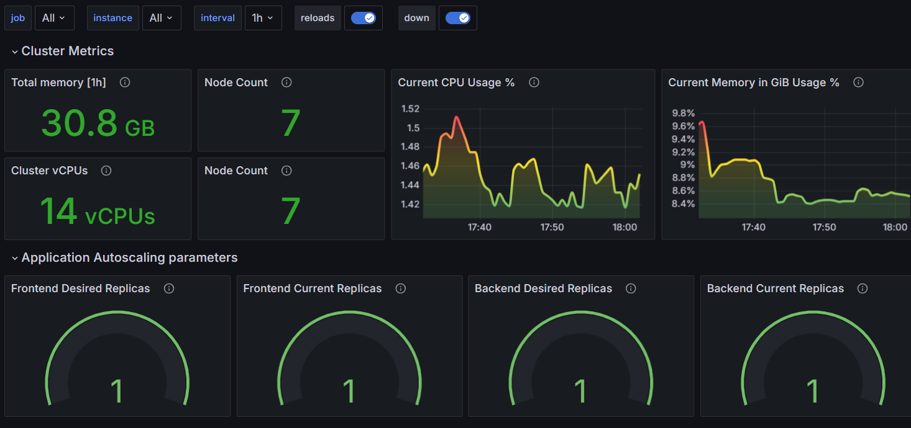

# Prometheus and Grafana Setup

This document outlines the setup and configuration of Prometheus and Grafana for monitoring our Kubernetes cluster.

## Overview
The Kubernetes External Secrets Operator is a tool that integrates external secret management systems with Kubernetes. It allows you to manage secrets stored in external providers (like AWS Secrets Manager, HashiCorp Vault, or Azure Key Vault) and sync them into Kubernetes secrets.
We use Prometheus for metrics collection and Grafana for visualization. Both are installed using Helm charts. Additionally, we've set up a custom dashboard in Grafana for monitoring our application.

### Prerequisites

- Helm 3.x installed
- kubectl configured to communicate with your cluster

## Installation
The below script installs the tools under consideration using helm, outputs grafana credentials and End points using a Loadbalancer:
```
./Secretsoperator_prometheus_grafana/deploy.sh
```

If you do not want to access the end points via a load balancer, you can use it via port forward and remove exposition to public.
Follow the below commands to do so:
```
#for Grafana
kubectl patch svc grafana -p '{"spec": {"type": "ClusterIP"}}'
kubectl port-forward svc/grafana -n argocd 8080:443

#for prometheus
kubectl patch svc prometheus-server -p '{"spec": {"type": "ClusterIP"}}'
kubectl port-forward svc/prometheus-server -n argocd 8081:443
```

### Grafana dashboard creation

Grafana is to be configured to use Prometheus as a data source. This is typically done in Grafana UI.

To add the Prometheus data source:

1. Access the Grafana UI
2. Go to Configuration > Data Sources
3. Click "Add data source"
4. Select Prometheus
5. Set the URL to `http://your-prometheus-url`
6. Click "Save & Test"

## Custom Dashboard

We've created a custom dashboard to monitor our application. The dashboard configuration is stored in `./Secretsoperator_prometheus_grafana/Grafana_Dashboard/grafana_hpa_observability.json`. To import this dashboard:

1. Access the Grafana UI
2. Click the "+" icon in the left sidebar
3. Select "Import"
4. Upload the `dashboard.json` file or paste its contents

The dashboard includes panels for:
- CPU and Memory usage of frontend and backend deployments
- Request rate and latency
- MongoDB metrics
- Node metrics



## Accessing Grafana

To access Grafana:

Get the Grafana admin password:
   ```
   kubectl get secret --namespace monitoring grafana -o jsonpath="{.data.admin-password}" | base64 --decode ; echo
   ```


## External Secrets Operator

We've installed the External Secrets Operator to manage secrets from external sources. This allows us to securely store and manage sensitive information like API keys and database credentials. Create a Secret object and add a Service account to it, to create and pull secrets from external secret manager. 