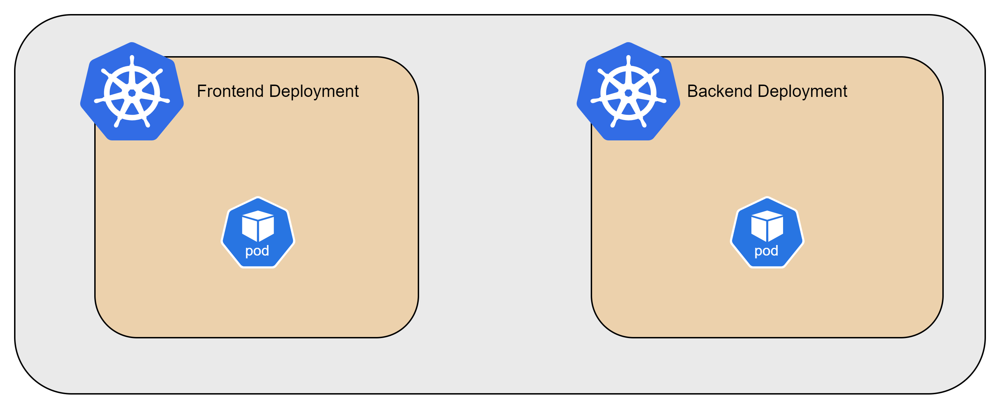
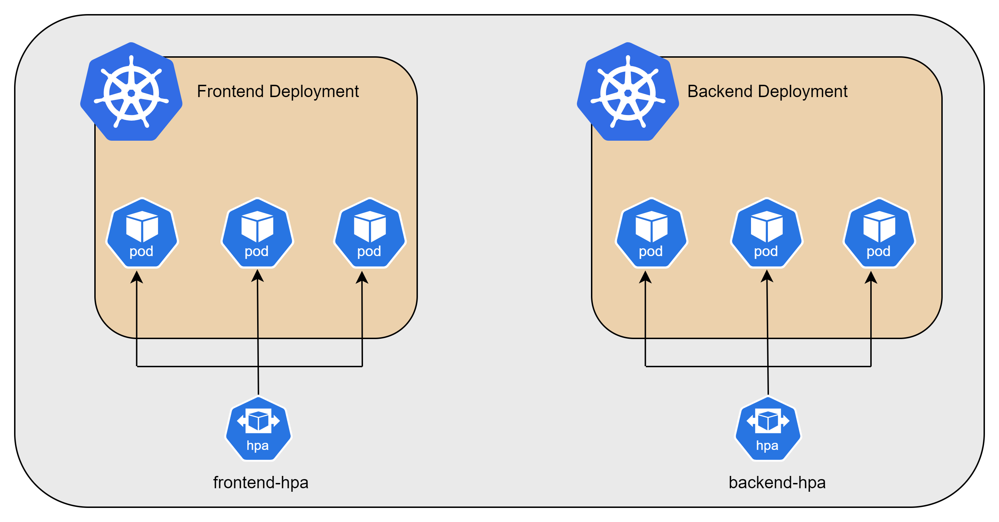
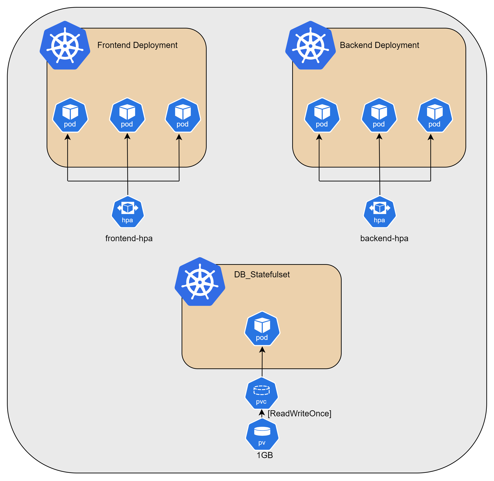
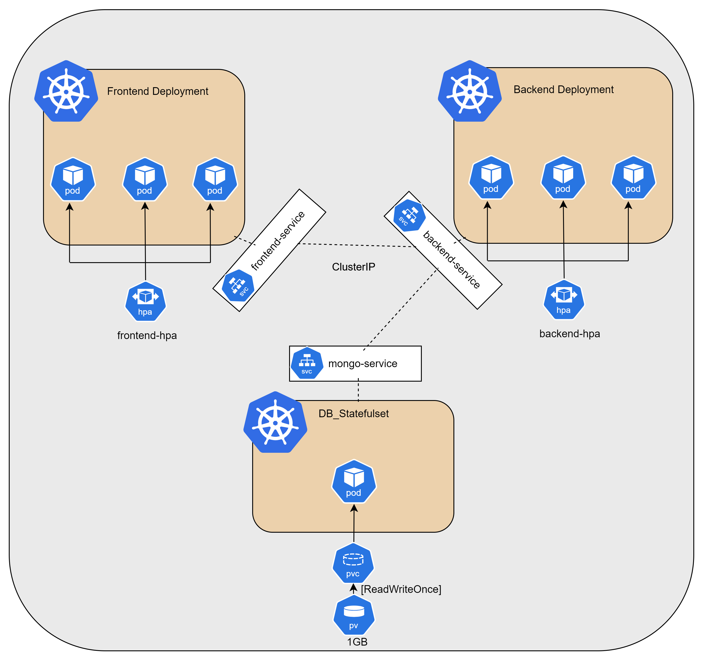
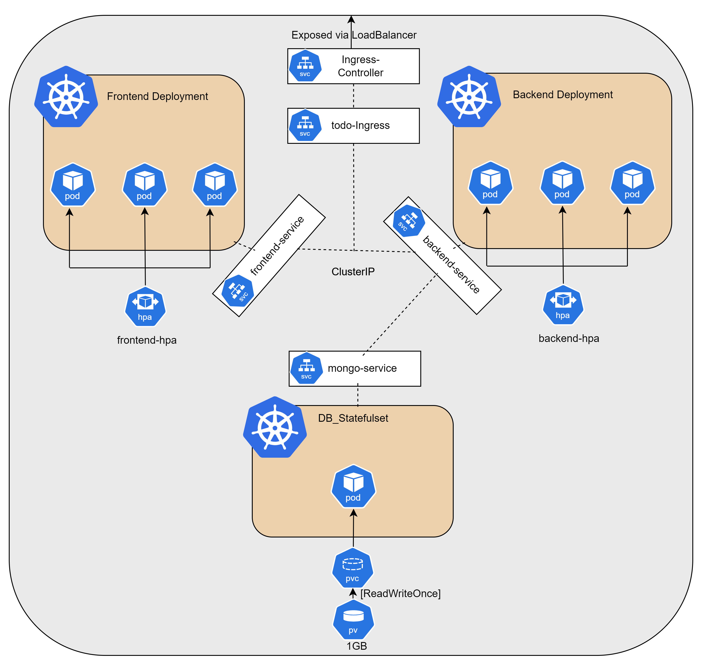
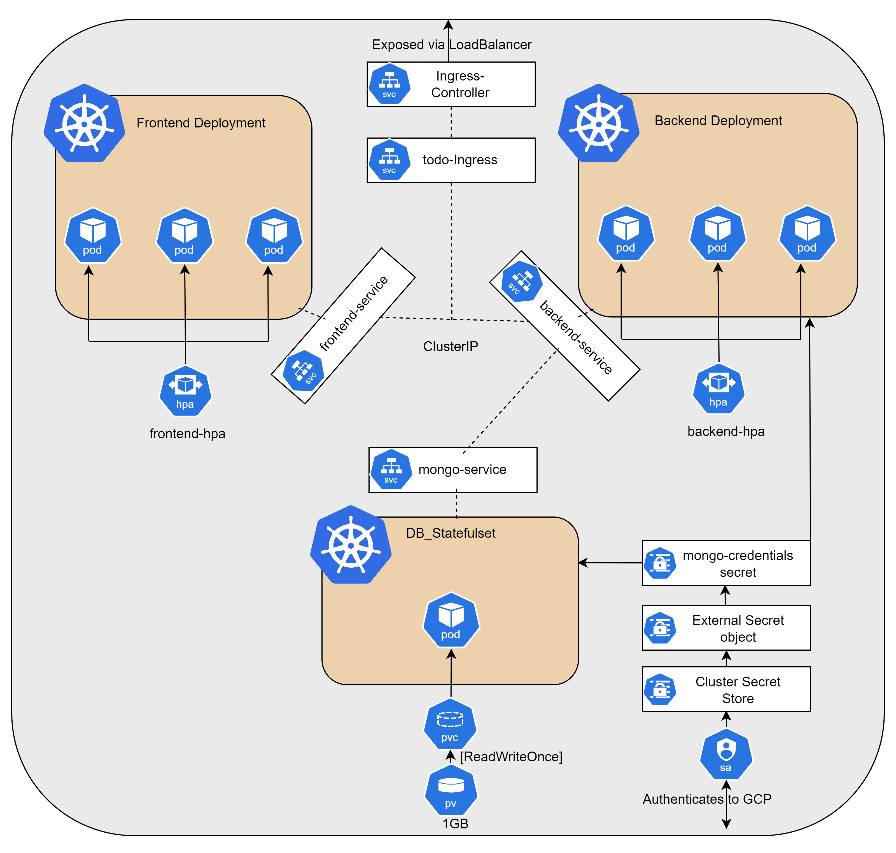

# Kubernetes Implementation

This document outlines the Kubernetes resources and configurations used in our project.

## Overview

Our Kubernetes setup includes:
- Frontend and backend deployments with Horizontal Pod Autoscalers (HPA)
- MongoDB StatefulSet
- Ingress controller and objects
- Network policies
- Service configurations
- External Secrets integration

### Deployments
There are two deployments in the project Front end and Backend. these have a single replicas to begin with.

### Horizontal Pod Autoscaler
The GKE Cluster is enabled with HPA with the below parameters:
 - frontend-hpa: minReplicas: 1 maxReplicas: 10 targetCPUUtilizationPercentage: 50
 - backend-hpa: minReplicas: 1 maxReplicas: 20 targetCPUUtilizationPercentage: 50

### Database StatefulSet
The DB is configured as Statefulset and persistent volumes are attached to the pods using standard storage class.

### Services
The file ./manifests/services.yaml has configurations for 3 services frontend-service, backend-service and mongo-service configured as type ClusterIP.

### Networking
In the ./manifests/networking.yaml field has Network policy to reject connections to DB pod other than backend pods. It also has Ingress defined to allow connections to frondend and backend api.
The file ./manifests/ingress-controller/install-ingresscontroller.yaml has the ingress controller details. Ingress controller helps in the ingress object and helps routes connections to the required services.

### Secrets Management
There are some secrets that are needed to store securely. The same is done in the following way:
1. Deploy External Secrets operator in the cluster using helm. The same is implemented using the ./secretsoperator_prometheus_grafana/deploy.sh.
2. Create Service account that will be used to authenticate in the GCP to access secrets manager.
3. Create permissions in GCP to the service account to read the secrets. The same is implemeted using terraform.
4. Create a External secrets object which will use the operator and creates secrets which will be used within the pods

