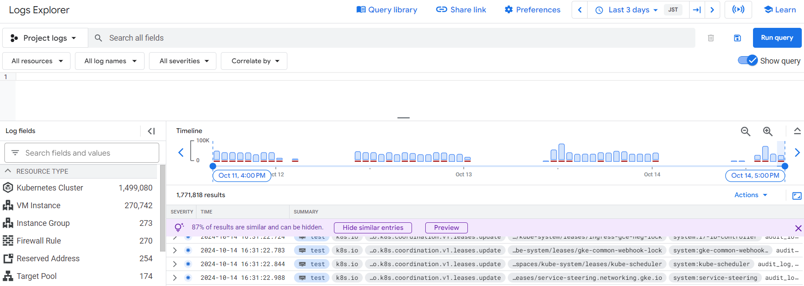

# Logging in GKE

This document outlines the logging setup for our Google Kubernetes Engine (GKE) cluster, which utilizes the default logging capabilities provided by GKE.


## Overview

GKE provides built-in logging functionality that captures logs from all containers running in the cluster, as well as system components. These logs are automatically exported to Google Cloud's operations suite (formerly Stackdriver).

## Default Logging

By default, GKE enables logging for:

1. Container logs
2. System logs
3. Audit logs

These logs are automatically collected and sent to Cloud Logging without any additional configuration required.

## Accessing Logs

You can access the logs through several methods:

1. **Google Cloud Console:**
   - Navigate to Kubernetes Engine > Services & Ingress
   - Select a workload
   - Click on the "Logs" tab

2. **gcloud command-line tool:**
   ```
   gcloud container clusters describe YOUR_CLUSTER_NAME --zone=YOUR_ZONE
   ```

3. **Cloud Logging API:**
   You can use the Cloud Logging API to programmatically access and analyze logs.

## Log Filters

To filter logs effectively, you can use Cloud Logging's query language. Here are some useful filters:

- Filter by namespace:
  ```
  resource.type="k8s_container"
  resource.labels.namespace_name="default"
  ```

- Filter by pod name:
  ```
  resource.type="k8s_container"
  resource.labels.pod_name="your-pod-name"
  ```

- Filter by container name:
  ```
  resource.type="k8s_container"
  resource.labels.container_name="your-container-name"
  ```

## Log Retention

By default, logs are retained for 30 days. You can configure custom retention periods in Cloud Logging if needed.

## Troubleshooting

For troubleshooting, consult the [GKE troubleshooting guide](https://cloud.google.com/kubernetes-engine/docs/troubleshooting).